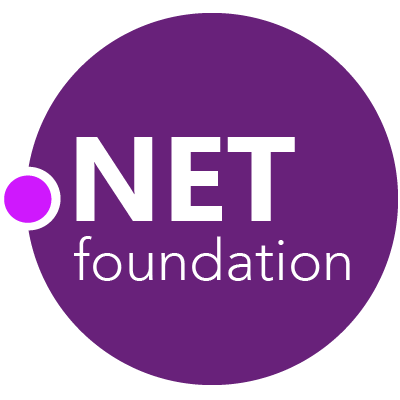

# Modernizing

# To .NET Core

[netcore-workshop.seankilleen.com](https://netcore-workshop.seankilleen.com/)

---

---

<!-- _footer: "" -->

---

<!-- _footer: "" -->

# <!--fit--> Hi! :wave: I'm Sean

- :bird: [sjkilleen](https://twitter.com/sjkilleen)
- :earth_americas: [SeanKilleen.com](https://seankilleen.com)
- :briefcase: [Excella](https://excella.com)

---
<!-- _footer: "" -->

---

# Ground Rules

---
<!-- _footer: "" -->

<!-- 
- Content might not be for you
- Some parts might be rough
- Your feedback is going to be really important
-->

---
<!-- _footer: "" -->

---

## Agenda for the Day

<!-- 
- Presentation Overview
- Assessing sample project
- Converting step-by-step
- Adding some new goodies
-->

---

## Logistics

- Breaks
- Catching Up
- Questions / Parking Lot
- Choose your Own Adventure

---

# Note: Interaction

---
<!-- _footer: "" -->

---

## Why Update to .NET Core?

---

#### Why .NET Core?

# Performance

---

---
<!-- _footer: "" -->

---
<!-- _footer: "" -->

---

#### Why .NET Core?

# Platforms

---

---

#### Why .NET Core?

# Community

---

---

#### Why .NET Core?

# Other Goodies

---

#### Other Goodies

# Kestrel

---

#### Other Goodies

# HTTP/2

<!-- 
Came from SPDY
Reduce latency by enabling full request and response multiplexing
Minimize protocol overhead via efficient compression of HTTP header fields
add support for request prioritization
add support for server push
-->

---

#### Other Goodies

# Single .exes

---

#### Other Goodies

# Built-in DI

---

#### Other Goodies

# Health Checks

---

#### Other Goodies

# Razor Pages

---

#### Other Goodies

# Razor components

---

#### Other Goodies

# Blazor

---

#### Other Goodies

# Websockets

# &amp; signalR

---

#### Other Goodies

# Self-hosted apps

---

#### Other Goodies

# Containerization

---

# .NET 5

---
<!-- _footer: "" -->

---

#### Why _Not_ Upgrade?

---

#### Why _Not_ Upgrade?

## Webforms / WCF

<!--
  - Still has a WCF Client
-->

---

#### Why _Not_ Upgrade?

## Not a 1:1

---

#### Why _Not_ Upgrade?

## Monoliths

---

## Challenge

## Vs

## Opportunity

---

<!-- I'm new at this -- will do my best to answer questions -->

---

## Introducing

## The Sample App

---

[https://github.com/SeanKilleen](https://github.com/SeanKilleen/netcoreworkshop-mvcmovie-sample)

[/netcoreworkshop-mvcmovie-sample](https://github.com/SeanKilleen/netcoreworkshop-mvcmovie-sample)

---

<!-- _footer: "" -->

# <!--fit--> Thanks

- :bird: [sjkilleen](https://twitter.com/sjkilleen)
- :earth_americas: [SeanKilleen.com](https://seankilleen.com)
- :briefcase: [Excella](https://excella.com)
